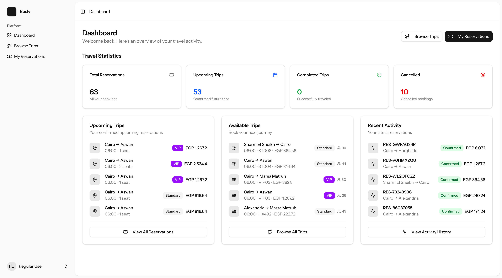
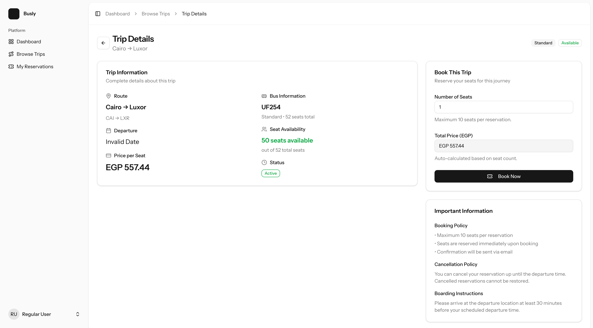
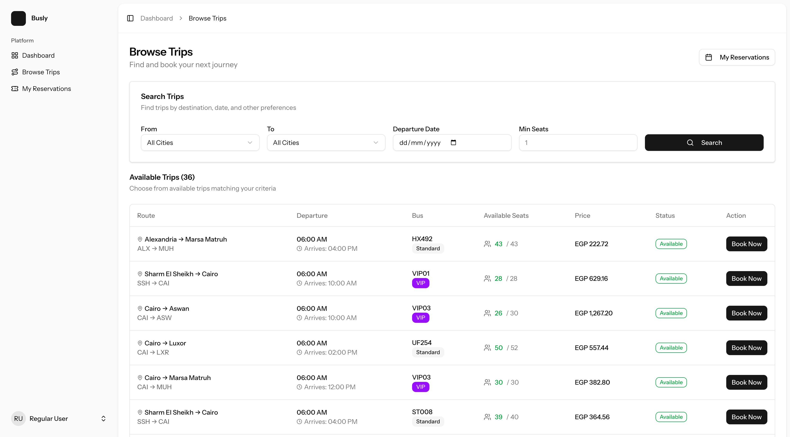
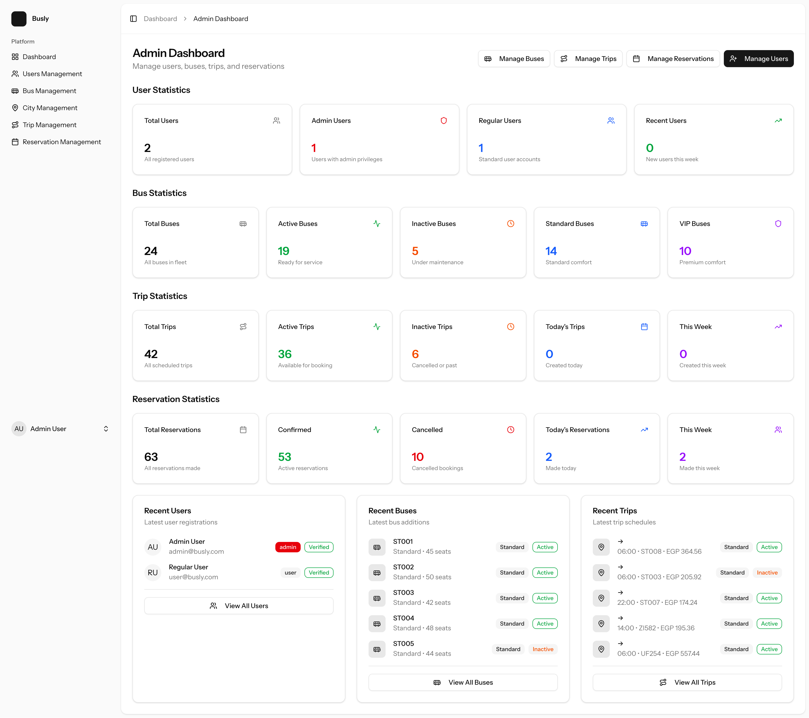
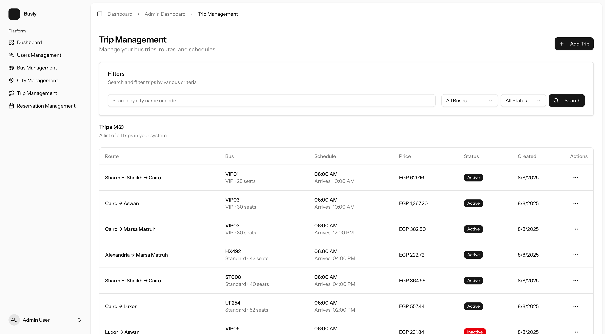
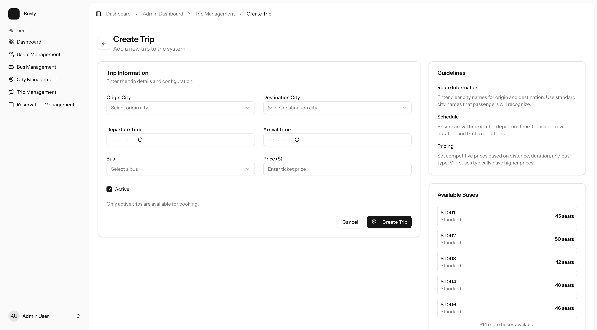
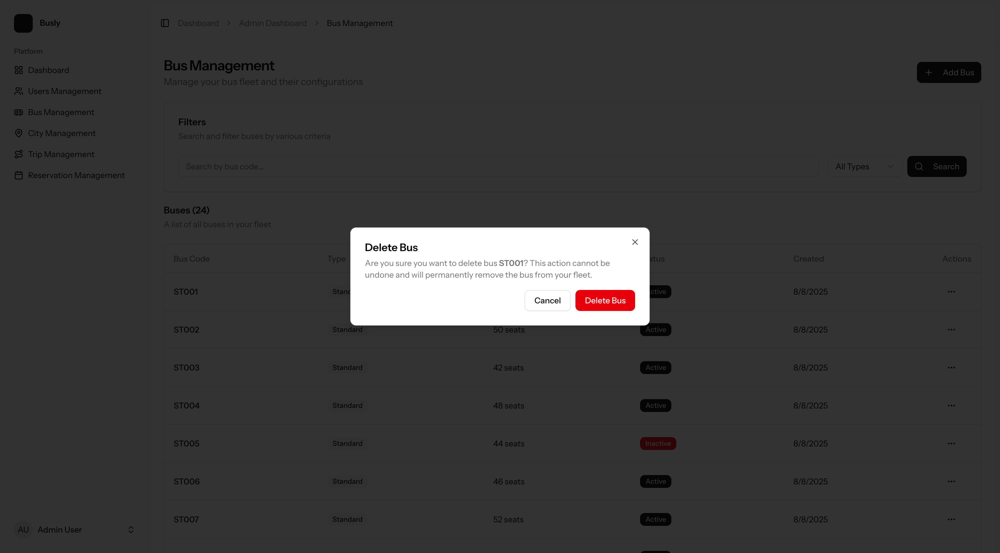

# Busly

This is the backend of the Busly project, a bus reservation application.
It was created to help people book bus trips across multiple cities in a more organized and efficient way.

## Installation

Busly backend is a Laravel application; it's built on top of Laravel 12 and uses a MySQL database.
It's recommended to use Laravel Sail to run the application, but you can also run it locally if you have MySQL installed.

1. **Clone the repository:**
   ```bash
   git clone https://github.com/Msalah11/busly.git
   cd busly
   ```

2. **Run Sail to start the development server:**
   ```bash
   ./vendor/bin/sail up -d
   ./vendor/bin/sail shell
   ```

3. **Install PHP dependencies:**
   ```bash
   composer install
   ```

4. **Install Node.js dependencies:**
   ```bash
   npm install
   ```

5. **Copy the example environment file and generate an application key:**
   ```bash
   cp .env.example .env
   php artisan key:generate
   ```

5. **Run migrations and sedders:**
   ```bash
   php artisan migrate
   php artisan db:seed
   ```

## Packages

**Laravel Sail**  
Laravel Sail is a light-weight command-line interface for interacting with Laravel's default Docker development environment.

**Pest**  
Pest is a testing framework with a focus on simplicity, meticulously designed to bring back the joy of testing in PHP.

**Larastan**  
Larastan focuses on finding errors in your code. It catches whole classes of bugs even before you write tests for the code.

**Laravel Pint**  
Laravel Pint is an opinionated PHP code style fixer for minimalists.

**Rector**  
Rector instantly upgrades and refactors the PHP code of your application.

**laravel/telescope**  
Telescope provides insight into the requests coming into your application, exceptions, log entries, database queries, queued jobs, mail, notifications, cache operations, scheduled tasks, variable dumps, and more.

## Features

- **City Management**: Add and manage cities for bus routes
- **Bus Fleet Management**: Manage buses with different types and capacities
- **Trip Scheduling**: Create and manage bus trips between cities
- **Reservation System**: Allow users to book seats on available trips
- **User Dashboard**: Users can view their reservations and trip history
- **Admin Dashboard**: Comprehensive admin panel for managing the entire system
- **Role-based Access Control**: Separate access levels for users and administrators

## Screenshots

### User Interface

#### Home Page
The main landing page where users can search for available trips.



#### Trip Booking
Users can view trip details and book their seats with an intuitive booking interface.



#### User Trip Management
Users can view and manage their booked trips and reservation history.



### Admin Interface

#### Admin Dashboard
Comprehensive dashboard providing overview of system statistics and key metrics.



#### Trip Management
Admin interface for managing all trips in the system.



#### Trip Creation Form
Detailed form for creating and editing trip information.



#### System Alerts
Admin panel for monitoring system alerts and notifications.



## Testing

To run all tests, use the following command:
```bash
composer test
```

To run specific test suites:

```bash
# Run PHPStan static analysis
composer test:types

# Run Pest unit tests
composer test:unit

# Run Rector tests
composer test:rector

# Apply Rector changes
composer rector

# Run code style tests
composer test:lint

# Fix code style
composer lint

# Run type coverage tests
composer test:type-coverage
```

## License

This project is licensed under the MIT License. See the LICENSE file for details.
